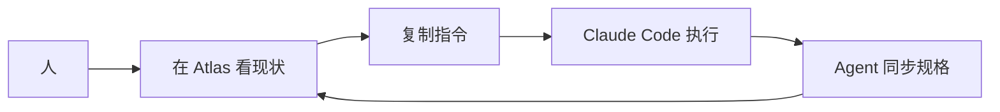

# 当前状态
v0.1.0 MVP 完成。基础闭环可用:产品总览、功能点表格、行级复制指令、跨产品契约、CLAUDE.md 中心、文件监听。

## 待办
- [ ] 用一周,记录每天最常看的视图和最烦的地方
- [ ] 根据使用反馈决定下一轮做哪个占位模块

## 阻塞
- 无

## 功能点

| ID | 描述 | 状态 | 优先级 | 接口 | 备注 |
|----|------|------|--------|------|------|
| F1 | 产品总览 + 主题分组 | done | P0 | - | MVP 已实现 |
| F2 | 单产品详情 + Markdown 渲染 | done | P0 | - | MVP 已实现 |
| F3 | 功能点行级指令复制 | done | P0 | - | MVP 已实现 |
| F4 | 跨产品契约管理 | done | P0 | - | 基础版 |
| F5 | 文件监听自动刷新 | done | P0 | SSE | MVP 已实现 |
| F6 | 录入向导(Intake Module) | doing | P0 | - | 见第二步 |
| F7 | 双轨设计区 | todo | P1 | - | 占位中 |
| F8 | 待办看板 | todo | P1 | - | 占位中 |
| F9 | AI 触点管理 | todo | P2 | - | 占位中 |

## 流程图

