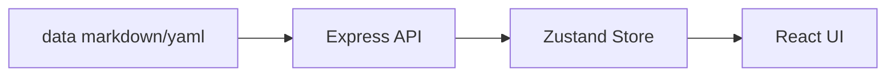

# Atlas Architecture

Atlas MVP 是一个本地运行的 monorepo。

- `apps/web`: Vite + React 18 + TypeScript + Tailwind CSS 前端。
- `apps/api`: Express 文件读取 API，负责读取 `data/`。
- `packages/shared`: 前后端共享 TypeScript 类型。
- `data/`: markdown/yaml 数据源，日后可以剥离为独立 meta-repo。

数据流:

MVP 不包含登录、数据库、部署、健康度计算、变更历史、关联图和导出。
