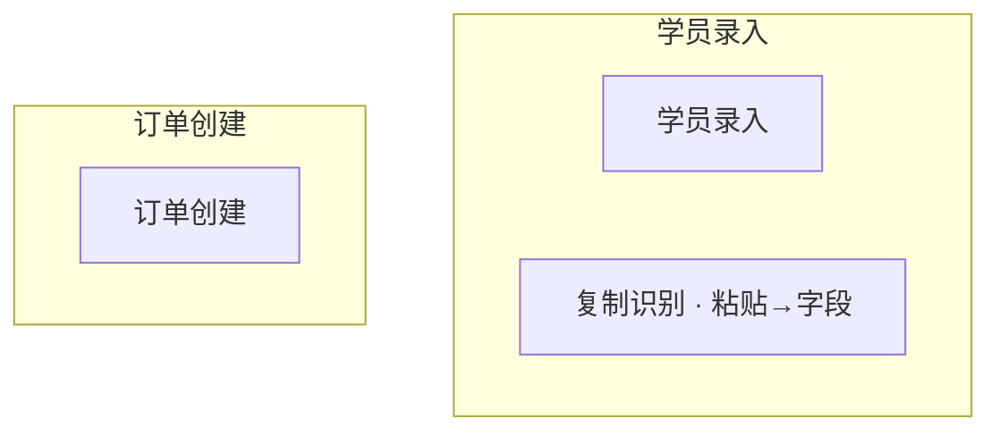
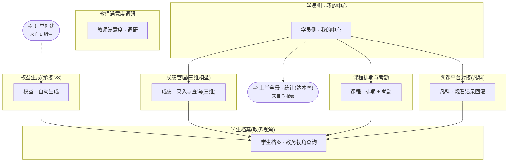

# Atlas 决策者流程图 Contract

> 这份文档定义 Atlas **决策者视角的流程图** 输出格式 —— 给业务决策方 / 业务方看的、按模块切分的流程图。
>
> 与 `flowchart-contract.md`(老版,工程师/实体派生 Agent 用)**并存**。两边各管各的:
> - 老版:`main.mmd`(单文件 · entity.action.scope 节点 · 给实体派生 Agent 当锚点)
> - 本版:`by-module/<moduleId>.mmd` × N(每模块一张 · feature 级节点 · 给决策者看)
>
> 修改本文档需要架构层级的审批。

---

## 1. 目的

业务决策方**审阅 ERP 功能完整性**时,要能在流程图上扫一眼看清:
- 该模块下有哪些 feature(节点)
- feature 之间怎么触发(连线)
- 哪些 feature 依赖其他模块(跨模块虚线引用)

**不要**给决策者看 `Entity.action.scope <<roles>>` 这种工程节点 —— 那是给 Agent 看的(走老 contract)。

---

## 2. 文件结构

```
data/products/<productId>/derived/flowcharts/
├── main.mmd                       # 老 contract,工程师视角,不动
├── main.questions.md              # 老 contract questions,不动
├── by-module/
│   ├── product.mmd                # A 产品(对应 modules/product/)
│   ├── sales.mmd                  # B 销售
│   ├── finance.mmd                # C 财务
│   ├── dictionary.mmd             # D 字典
│   ├── channel.mmd                # E 渠道
│   ├── academic.mmd               # F 教务
│   └── reports.mmd                # G 报表
├── overview.mmd                   # 可选 · 模块间数据流总览(7 个 module 作为节点 + 接缝 §5.x 作为 arrows)
└── by-module/questions.md         # 可选 · per-module 拿不准的事统一在这一份(per-module 拿不准的事,Agent 用)
```

**规则**:
- 每个 module 一份 `.mmd` 文件,文件名 = `modules/` 下的子目录名(kebab-case)
- 没有 features 的 module 不生成文件(避免空图)
- overview.mmd 是可选的,如果做就放跨模块接缝;不做也行,UI 只展示 by-module 切片

---

## 3. 节点格式(决策者视角)

### 3.1 节点 = feature

```mermaid
F_<feature_id>["<feature.name>"]
```

例:
```mermaid
F_student_intake["学员录入"]
F_order_creation["订单创建"]
F_payment_collection["回款 · 记录与跟踪"]
```

- `F_` 前缀避免与 mermaid 关键字冲突
- `<feature_id>` 用 `_` 替代 `-`(mermaid id 不允许 `-`)
- 节点 label = `feature.name` 字段(已经是"对象 · 动作"格式,适合决策者读)
- 不出现 entity / action / scope / roles 等工程概念

### 3.2 跨模块引用(虚线节点)

如果一个 feature 触发了**其他模块**的 feature,用虚线方框表示外部引用:

```mermaid
X_<external_feature_id>(["⇨ <feature.name><br/><small>来自 <module 显示名></small>"])
```

例(F 教务模块的图里引用 B 销售的 order-creation):
```mermaid
X_order_creation(["⇨ 订单创建<br/><small>来自 B 销售</small>"])
```

- `X_` 前缀 = external
- 用 `(["..."])` 椭圆形而不是方块,视觉区分
- label 带"⇨"指示符 + 副标"来自 X 模块"
- **不连出**只表示"我是被引用方";如果是"我引用他",同理用 `X_` 节点

### 3.3 subgraph = module_group

每个 module 的 .mmd 用 `module_group` 作为 subgraph 分组:

```mermaid
flowchart TD
  subgraph G_<group_id>["<group 显示名>"]
    F_<feature_id>["..."]
    ...
  end
```

例:


- `G_` 前缀避免冲突
- 没有 `module_group` 的 feature 单独挂在 module 根层级

---

## 4. 连线(arrows)

### 4.1 数据来源:feature md 的"触发后续"

每个 feature md 的 `**触发后续**:` 字段是 arrows 的**唯一**数据源。

例 [student-intake](../../data/products/yunkai-erp/modules/sales/features/student-intake.md):
```
**触发后续**: order-creation (订单创建) · invoice-request (按需建发票申请) · 接缝 5.5 (B→E)
```

转成 arrows:
```mermaid
F_student_intake --> F_order_creation
F_student_intake --> X_invoice_request
```

注释别的(如"接缝 5.5")可以丢在 mermaid 注释里或者 overview 里展示,**不进 per-module 流程图**(避免画蛇添足)。

### 4.2 箭头样式
- **同模块 feature** 之间:实线 `-->`
- **跨模块 feature**(指向 `X_` 节点):虚线 `-.->` 表示弱依赖

### 4.3 不画的
- ❌ 不画 entity 级别的 CRUD action 关系(那是 main.mmd 干的事)
- ❌ 不画 role swimlane(per-module 图按 group 分,不按 role 分)
- ❌ 不画"如果失败回滚"等异常分支(决策者不关心)
- ❌ 不画条件分支(决策者不关心)
- ✅ 只画"主路径触发关系" —— 业务上 happy path

---

## 5. 文件头注释

每个 `by-module/<moduleId>.mmd` 必须包含:

```
%% Module: <moduleId> · <module 显示名>
%% 视角: 决策者— 展示该模块下功能点的业务触发关系
%% 来源: data/products/<productId>/modules/<moduleId>/(features/ 的 触发后续 字段)
%% 生成时间: <ISO timestamp>
%% 注意: 不要写单独一行的 %%(只有两个百分号没内容会让 mermaid 解析器炸)
```

**禁止**:
- ❌ 写单独一行的 `%%`(只有两个百分号没内容会让 mermaid 解析器炸,见 [generatePromptBuilder.ts](../apps/api/src/services/generatePromptBuilder.ts) 注释)
- ❌ 写工程师视角的"Agent notes"(那是老 contract 的事)

---

## 6. 完整示例(F · 教务模块)



---

## 7. Agent 的自由度

- ✅ Agent 可以决定 LR / TD 布局方向(优先 TD,如果 feature 数 > 10 改 LR)
- ✅ Agent 可以决定 subgraph 内 feature 顺序(优先按 group order)
- ✅ Agent 可以决定哪些跨模块引用值得画出(只画"触发后续"显式提到的)
- ❌ Agent 不可以编造 features / 关系(只能用 feature md 里的 `触发后续`)
- ❌ Agent 不可以省略某 feature(同模块所有 feature 都要画)
- ❌ Agent 不可以加 entity / action / role 字眼到节点 label

---

## 8. 与老 contract 的差异速查

| 维度 | 老 contract(`main.mmd`) | 本 contract(`by-module/*.mmd`) |
|---|---|---|
| 视角 | 工程师 / Agent | 决策者 |
| 文件数 | 1(整产品) | N(每模块 1) |
| 节点 | Entity.action.scope <<roles>> | F_feature_id["feature.name"] |
| subgraph | 角色 swimlane | module_group 分组 |
| 连线源 | Agent 从 feature.description 推断 | feature md 的 `触发后续` 字段 |
| 用途 | 实体派生 Agent 输入 | UI 给决策者看 |

---

**文档结束 · v1.0**
