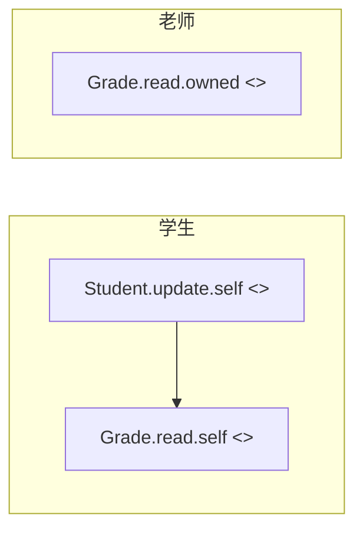
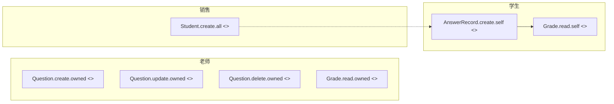

# Atlas 流程图 Contract

> 这份文档是 Atlas 衍生流程图的"形式契约"，是**两个 Agent 之间的接口规范**：
> - **上游**：流程图生成 Agent 必须遵守本文档把功能点+角色翻译成 Mermaid swimlane。
> - **下游**：实体派生 Agent 必须假设流程图严格遵守本文档，并据此提取候选实体。
>
> 修改本文档需要架构层级的审批；不要由实现侧自行调整。

---

## 1. 目的与作用域

### 1.1 这份 contract 钉的是什么

只钉 **节点身份**：一个流程图节点由四个维度唯一确定——

1. **实体（Entity）**：被操作的资源
2. **动作（action）**：对资源的读/写动作
3. **访问范围（scope）**：操作能触及的资源子集（可省略，详见 §2.3）
4. **参与角色（roles）**：发起或参与该操作的角色集合

满足"四元组相同"的节点必须合并为同一个；任何一维不同必须保留为独立节点（详见 §3）。

### 1.2 这份 contract 不钉的是什么

**业务逻辑层面**的一切都不在 contract 内（详见 §6），包括但不限于：

- 节点之间的连线方向、先后顺序
- 条件分支、循环、错误处理
- 触发条件（"什么事件启动这个流程"）
- 节点视觉样式
- 子图分组策略

这些由生成 Agent **从功能点描述中推断**，不由本 contract 约束。Agent 的推断空间只在"业务流转怎么走"这一维度上，不允许扩展到"该不该出现这个节点"。

### 1.3 上游输入与下游输出的关系

```
功能点tab (含 roles)          ──┐                            ┌─► main.mmd ──► 实体派生 Agent ──► 候选实体清单
data/roles.yml (角色注册表)    ──┼──► 流程图生成 Agent ──┤
docs/flowchart-contract.md  ──┘                            └─► main.questions.md (诊断单,见 §6.3)
```

`main.mmd` 是**唯一**的实体派生输入。下游 Agent 不读功能点 tab、不读角色注册表、也不读 questions.md——它只能读 main.mmd。所以 main.mmd 必须自闭包：节点命名足以让下游单独识别每个"实体操作签名"。

`main.questions.md` 是 Agent 给人看的诊断单（详见 §6.3），下游派生不消费它。

---

## 2. 节点命名格式

### 2.1 形式

```
[Entity].[action].[scope] <<roles: 角色1, 角色2>>
```

- `Entity`、`action`、`scope` 之间用英文句点连接
- `<<roles: ...>>` 紧跟其后，前面有一个空格
- roles 内部用中文逗号 `，` 或英文逗号 `,` + 空格分隔；推荐英文逗号 + 一个空格（`角色1, 角色2`）以便 grep
- 节点的 Mermaid 文本（`A[...]` 里的 `...`）就是这串，不允许加序号、加时间戳、加业务前缀

### 2.2 字段约束

| 字段   | 命名规则                                       | 例                                           |
|--------|------------------------------------------------|----------------------------------------------|
| Entity | PascalCase；单数；业务实体名（非表名）         | `Student` / `Order` / `Grade` / `Attendance` |
| action | lowercase；CRUD 或业务动词（动词原形）         | `create` / `read` / `update` / `delete` / `enroll` / `refund` / `submit` |
| scope  | `self` / `owned` / `all` 三选一；可省略         | 见 §2.3                                      |
| roles  | RolesRegistry 中的中文 name（不是 id）         | `学生, 老师`                                 |

为什么 roles 用中文 name 而不是 id：流程图给人看，名字是显示物；id 在源数据里（data/roles.yml、feature frontmatter）保证机器侧一致性即可。下游实体派生 Agent 也读 name——它的输入只有 main.mmd。

### 2.3 Scope 的判定 —— 何时写、何时省略

**核心判定问句**：

> 同一个 `Entity.action`，不同角色调用时是否会触及不同的资源子集？

- **答"是" → 必须显式写 scope**（即便目前只有一个角色在用该动作，也保守写明）
- **答"否" → 省略 scope**

#### Scope 的三个值

| scope    | 含义                                                                       |
|----------|----------------------------------------------------------------------------|
| `.self`  | 操作的目标资源**就是发起角色自身**（学生看自己的成绩、家长更新自己手机号） |
| `.owned` | 操作的目标资源**在发起角色的管辖范围内**，但不是发起角色本身（老师看自己班学生的成绩、销售看自己签的订单） |
| `.all`   | 操作不受访问范围约束（管理员看所有成绩、教务看所有学籍）                   |

#### 判定 checklist（Agent 触发时按顺序回答）

1. 该动作只有一个角色能做，且未来也不会出现别的角色 → **省略 scope**。
   - 例：`Config.update <<roles: 管理员>>` — 不写 `.all`。
   - 注：写不写 `.all` 不影响下游派生，但 contract 选择最简形式。
2. 该动作多个角色共用，但**所有角色拿到的资源集合等价** → **省略 scope**。
   - 例：所有角色都能查询字典表 → `Dictionary.read <<roles: 销售, 教务, 财务>>`。
3. 该动作多个角色共用，**至少一个角色看到的子集不同** → **必须写 scope**，每个角色按其访问范围拆成独立节点。
   - 例：学生看自己成绩 / 老师看自己班学生的成绩 / 管理员看所有成绩 → 三个节点。
4. 当不确定子集是否真的不同（例如"销售看订单"和"管理员看订单"），**默认保留 scope 拆分**。误拆的代价是节点数多 1，误合的代价是下游派生丢失权限差异——后者更贵。

#### Scope 边界 case 速查

| 场景                                                       | 处理                                                                                              |
|------------------------------------------------------------|---------------------------------------------------------------------------------------------------|
| 一个角色对自己的资源做写操作（学生改自己手机号）           | `Student.update.self <<roles: 学生>>`                                                             |
| 同一个角色既能改自己又能改别人（管理员可改自己也可改任何人）| 拆两个节点：`Student.update.self <<roles: 管理员>>` 与 `Student.update.all <<roles: 管理员>>` —— scope 不同必须拆，即使发起者是同一个角色 |
| 多角色都用 `.self`（学生改自己手机号 / 老师改自己手机号） | **合并**为 `User.update.self <<roles: 学生, 老师>>`，因为四元组相同（同实体 User / 同动作 / 同 scope / 不同角色集合归一） |
| 系统级单角色操作（管理员唯一能做的配置更新）               | 省略 scope：`Config.update <<roles: 管理员>>`                                                     |
| 临时只有一个角色，但语义上未来可能扩展（销售下单，未来财务可能也下单）| 写明 scope：`Order.create.owned <<roles: 销售>>` —— 防止下游派生今天没看到权限差异，明天扩角色后才发现 |

---

## 3. 去重规则

### 3.1 唯一性原则

**同 Entity + 同 action + 同 scope = 同一个节点。**

`roles` 在去重判定中**不是**身份维度——它是身份内的"参与者集合"。如果发现两个节点四元组的前三维相同、只有 roles 不同，正确做法是**合并节点并合并 roles 集合**，不是拆成两个。

### 3.2 反例 —— 合并/拆分的典型陷阱

Agent 在去重判定上会犯两个方向的错。下面 5 个陷阱每个都标了**错误方向**和**正确动作**——review 时可按方向分类核对覆盖度：

- 陷阱 1：**Agent 想合并 → 必须保留独立**（scope 不同）
- 陷阱 2：Agent 想拆 → 必须合并（UI 入口干扰）
- 陷阱 3：Agent 想拆 → 必须合并（动作命名漂移）
- 陷阱 4：Agent 想拆 → 必须合并（roles 不同）
- 陷阱 5：**Agent 想合并 → 必须保留独立**（用伞名套住多个实体）

陷阱 1 和陷阱 5 是用户最担心的"看似可合并实则不可"的两种典型形态：前者把权限差异抹掉，后者把实体差异抹掉。两类合并的代价都是下游派生丢失维度信息。

#### 陷阱 1（不可合并）：scope 不同

```mermaid
%% ✗ 错误：把 .self 和 .owned 合并
Grade.read <<roles: 学生, 老师>>

%% ✓ 正确：保留为两个节点
Grade.read.self <<roles: 学生>>
Grade.read.owned <<roles: 老师>>
```

**Agent 的错觉**：学生和老师都在"看成绩"，看起来是同一个动作。  
**为什么不能合并**：学生看的是自己的一份；老师看的是一个班的若干份。下游实体派生 Agent 要根据 scope 推出"Grade 实体的权限矩阵"，合并后这条信息就丢了。

#### 陷阱 2（必须合并）：UI 入口不同但操作签名相同

```mermaid
%% ✗ 错误：把"个人中心 > 成绩"和"成绩页 > 我的成绩"建成两个节点
Grade.read.self.profile <<roles: 学生>>
Grade.read.self.grades <<roles: 学生>>

%% ✓ 正确：合并为一个节点
Grade.read.self <<roles: 学生>>
```

**Agent 的错觉**：功能点 tab 里有两个 feature，各自有 description，看起来是两件事。  
**为什么必须合并**：UI 入口不属于节点身份的任何一维。把 UI 入口编进 scope 是擅自扩展命名格式（§2.1 禁止）。两个 feature 都映射到同一个操作签名 → 同一个节点。

#### 陷阱 3（必须合并）：动作命名漂移但语义相同

```mermaid
%% ✗ 错误：因为功能点描述用了不同动词
Student.activate <<roles: 学生>>
Student.update.self <<roles: 学生>>

%% ✓ 正确：识别"激活"=更新 status 字段
Student.update.self <<roles: 学生>>
```

**Agent 的错觉**：功能点里写"学生点激活按钮"，UI 文案是"激活"，所以应该建一个 `activate` 动作。  
**为什么必须合并**：节点的 action 是**对实体的语义动作**，不是 UI 按钮文案。"激活"在实体层就是更新 Student.status 字段——它是 `update.self` 的一种特例。如果保留 `activate` 节点，下游派生会以为 Student 有一个"激活"动作但找不到对应字段更新逻辑。

**Agent 处理这类时的判据**：把 action 落到"实体的什么字段变了 / 什么读路径触发了"，而不是落到 UI 文案。

#### 陷阱 4（必须合并）：roles 不同但操作签名相同

```mermaid
%% ✗ 错误：每个角色一个节点
Dictionary.read <<roles: 销售>>
Dictionary.read <<roles: 教务>>
Dictionary.read <<roles: 财务>>

%% ✓ 正确：合并为一个节点，roles 列表合并
Dictionary.read <<roles: 销售, 教务, 财务>>
```

**Agent 的错觉**："每个角色独立画一个泳道里的节点更清楚"。  
**为什么必须合并**：roles 不是身份维度（§3.1）。拆开会让下游派生以为 Dictionary 有三个独立的读路径。

**注意**：合并后该节点在 Mermaid swimlane 中可能跨多个泳道——这是 Mermaid 渲染层面的事，不影响节点身份。可以选择放在最高频角色的泳道里并用连线指向其他角色泳道；也可以参考 §4.2 的"共享节点放置策略"。

#### 陷阱 5（不可合并）：用伞名把多个实体包装成一个节点

```mermaid
%% ✗ 错误：因为"都是查询自己的东西"就合并
SelfData.read.self <<roles: 学生>>

%% ✓ 正确：按真实实体拆分
Student.read.self <<roles: 学生>>
Grade.read.self <<roles: 学生>>
Attendance.read.self <<roles: 学生>>
```

**Agent 的错觉**：从角色视角看，这都是"查我的数据"。  
**为什么不能合并**：实体不同，下游派生需要对每个实体单独推字段。`SelfData` 不是业务实体，是 Agent 自创的伞名。

### 3.3 去重的判定流程

按这个顺序判，不要打乱：

1. 列出该 action 涉及的所有 (entity, action, scope) 三元组
2. 三元组相同的节点合并为一个，roles 取并集（按 RolesRegistry 中的顺序排列以便 diff 友好）
3. 三元组任一维度不同的节点保留为独立节点
4. 合并后做一次回扫：是否有节点的 entity 名是 Agent 自创的伞名？（陷阱 5）有的话拆开。
5. **跨节点回扫**：执行 §3.4 实体命名一致性检查。

### 3.4 实体命名一致性 —— 同持久化边界 = 同名

**规则**：同一个持久化边界（通常对应数据库中的一张表 / 一个 collection），在整张流程图中必须用**唯一的 Entity 名**。业务领域里的同义词（学员 / 学生 / 用户 / 账号 / customer / member / ...）若指向同一持久化记录，**Agent 在生成 main.mmd 时必须翻译为同一规范名**。

**为什么这条比业务可读性更重要**：

下游派生 Agent 把每个 Entity 名当作一个独立实体。如果 `Student.create.all <<roles: 管理员>>` 与 `User.authenticate <<roles: 学生, 管理员>>` 都指向同一张 `users` 表，但流程图叫了两个名，派生侧会输出 13 个候选实体而真实只有 12 个——over-production 完全因命名漂移而起。该问题在小产品里只是冗余，在大产品（几十张表 + 跨模块）里会指数放大并掩盖真实的实体识别误差。

**判断"是否同一持久化边界"的启发式**（Agent 用这套判断）：

| 信号 | 倾向同一边界 | 倾向不同边界 |
|------|--------------|--------------|
| 共享认证字段（password / token / login） | ✓ | — |
| 共享主键命名（user_id / account_id 通用 vs domain-specific） | ✓ | — |
| 在 description 中互为别称（"学员（即用户）"） | ✓ | — |
| 业务语境完全不同（学员的学习行为 vs 老师的授课记录） | — | ✓ |
| 不同生命周期（注册即创建 vs 报名才创建） | — | ✓ |

**规范名的选择原则**：

1. **优先最广义、最持久的名词**。例：`User` > `Student`，因为 User 适用于所有 role；将 student 视作 user 的一个 role 子集。
2. **PascalCase 单数**（与 §2.2 一致）。
3. **跨产品复用**：若 Atlas 多个产品都涉及"账户"概念，建议统一用 `User`，避免每个产品各起一个名。
4. 角色身份差异由 `<<roles: ...>>` 和 `action` 表达，**不**靠不同 Entity 名表达。`Student.create.all <<roles: 管理员>>` 应改为 `User.create.all <<roles: 管理员>>` —— 该节点的"被创建对象是学员"信息由 description 和上下文承载，不由 Entity 名承载。

**Agent 的执行步骤**：

1. 在生成计划阶段，**列一份本次涉及的所有业务领域名词**（从 features description 中抽取）。
2. 对每个名词判断它指向的持久化边界——可结合 description 中的字段提示、跨 feature 引用、行业常识。
3. 列出"建议规范名映射表"作为生成计划的一部分（例：`学员 / 学生 / 用户 → User`、`题目 → Question`），**输出给用户在生成计划阶段确认**。
4. 用户确认后，main.mmd 中所有节点严格使用规范名。
5. **拿不准时按 §6.3 走 questions.md**：把"业务名词 X 与业务名词 Y 是否同一持久化边界？"写成一条 question，trigger 引用两个 feature 的相关描述。

**反例**：

```mermaid
%% ✗ 错误：学员档案 vs 用户账号 同表多名
Student.create.all <<roles: 管理员>>     %% 来自 batch-import-students feature
User.authenticate <<roles: 学生, 管理员>>  %% 来自 login feature
Student.delete.all <<roles: 管理员>>     %% 来自 cleanup-duplicate-students

%% ✓ 正确：统一到 User
User.create.all <<roles: 管理员>>        %% 创建动作 + admin 角色已表明这是"管理员创建账户"
User.authenticate <<roles: 学生, 管理员>>
User.delete.all <<roles: 管理员>>
```

合并后下游派生 Agent 看到的是同一个 User 实体 + 5 个 action（authenticate / create.all / update.self / update.all / delete.all），不是两个伪实体。

**与陷阱 5 的区别**：

- 陷阱 5（§3.2）：Agent 用伞名（`SelfData`）把多个真实独立实体包装成一个 —— **错把多个合一**
- §3.4：Agent 用多个名字（`Student` + `User`）把同一持久化实体拆成多个 —— **错把一个分多**

两种错误方向相反，但都是 Entity 命名上的偏差，都会让派生失真。

---

## 4. 图类型与组织

### 4.1 必须是 Mermaid swimlane flowchart

使用 Mermaid 的 `flowchart` 语法 + `subgraph` 表示泳道；每个角色一个 subgraph。



**子图（subgraph）命名约定**：`S_<角色中文名>[<角色中文名>]`。前缀 `S_` 让 grep 区分 swimlane 和普通节点；中括号里是显示名。

### 4.2 跨多角色节点的放置

当一个节点的 roles 是多角色集合（§3.2 陷阱 4 的"合并后"情况），有两种处理：

- **方案 A（推荐）**：节点放在 roles 列表的第一个角色的 swimlane 里，其他角色 swimlane 用一个虚线节点引用过去。  
  适用场景：roles 之间有清晰的"主从"语义（例：销售/教务/财务共用字典，主用方是销售）。
- **方案 B**：建一个独立的 `S_shared[共享]` swimlane 放跨多角色节点。  
  适用场景：roles 之间是平等的、谁都不算主用方。

两种方案对节点身份没有影响；下游派生只看 `<<roles: ...>>` 里的列表，不关心节点放在哪个 swimlane。

### 4.3 文件头注释

每份 main.mmd 文件首行必须有一行注释，作为"derived"标签：

```mermaid
%% Generated from data/products/<productId>/modules/  · DO NOT EDIT HERE
%% Source of truth lives in feature points (功能点 tab).
%% Generated at: <ISO timestamp>
```

下游派生 Agent 检测到此头部 → 可安全消费；检测不到 → 应拒绝，提示用户重新生成。

---

## 5. 完整示例（示例产品场景）

### 5.1 输入（功能点摘录）

| 模块     | 功能点 id      | 名称       | roles            |
|----------|----------------|------------|------------------|
| learning | answer-question| 答题       | 学生             |
| learning | view-grade     | 查看成绩   | 学生, 老师       |
| content  | manage-qbank   | 维护题库   | 老师             |
| admin    | enroll-student | 录入学员   | 销售             |

### 5.2 期望输出（main.mmd 节选）



### 5.3 验收点对照

- `Grade.read` 拆成 `.self`（学生）和 `.owned`（老师）——避免陷阱 1
- `Question.create / update / delete` 三个动作三个节点，不合并为 "Question.manage"——manage 不是 §2.2 允许的动词
- `Student.create.all <<roles: 销售>>` 写明 `.all`——录入学员是销售对全体学员表的写入，明确 scope 防止未来增加权限差异时被忽略

---

## 6. 不在 contract 范围内 —— Agent 推断的边界

这一节直接决定 Agent 在哪些维度上有自由度。划线时态度：**节点身份零自由度，流程拓扑有限自由度**。

### 6.1 Agent 可以推断（流程拓扑维度）

以下事项**只在 §2/§3 合法的已有节点之间建立关系**，不创建新节点；这是 Agent 的自由度上限：

- **节点之间的连线方向**：A 先于 B，则 A → B。
- **条件分支**：`A -->|新学员| B`、`A -->|老学员| C`。
- **回路与循环**：学生答错继续答 → 自连线。
- **跨角色的协作箭头**：销售录入学员后，学生才能登录 → `Student.create.all -.-> User.read.self`。
- **同一 swimlane 内节点的纵向顺序**：表示该角色操作的自然先后。
- **跨多角色节点的放置策略**（§4.2 方案 A/B 二选一）。

判据：以上六条都属于"业务流转怎么走"，是流程描述层面的事，**与节点是否存在无关**。Agent 推断错了，人类看图就能发现并回功能点 tab 改 description。但若 Agent 借连线之名生造一个新节点（"为了让 A 连得通顺，中间补一个 X"），那是 §6.2 违规，不是流程推断。

### 6.2 Agent 不可以做（节点身份维度）

以下行为视作 contract 违规，UI review 或下游派生检测到必须打回重生成：

- **不可自创节点身份**：功能点 tab 里没出现的实体、没出现的动作、没出现的角色组合，不允许出现在流程图里。
  - 例：功能点全部 roles 都是"学生"，Agent 不能加一个 `<<roles: 老师>>` 节点"为了流程完整"。
- **不可改命名格式**：不允许 `Order.create_v2` / `Order:create` / `OrderCreate` / `订单.创建`。命名格式严格遵守 §2.1。
- **不可自创访问范围值**：scope 只能是 `self` / `owned` / `all` 三个值或省略；不允许 `.team` / `.dept` / `.public` 等。如果业务真有第四种 scope 概念，**回头改 contract**，不要让 Agent 现场扩。
- **不可为视觉效果凑节点**：节点不可以是"中间状态展示"用的占位（例如 `OrderForm.show`）——UI 形态不是实体操作。
- **不可省略 roles**：每个节点 `<<roles: ...>>` 必填，至少一个角色；roles 列表里的角色必须在 RolesRegistry 中。

### 6.3 Agent 拿不准时的回退策略 —— questions.md 兜底

#### 6.3.1 questions.md 的身份

`main.questions.md` 是**纯 derived 产物**：

- **位置**：和 main.mmd 同级，即 `data/products/<id>/derived/flowcharts/main.questions.md`
- **生命周期**：每次重生成都全量重写；上一轮的内容不保留
- **不接受用户编辑**——任何"已解答"标记或答案文本都不会被下一次生成读取
- 用户对问题的答复**只能通过编辑功能点 tab 的 description / roles** 实现

这条规则保证 source of truth 唯一：功能点 tab。questions.md 是 Agent 给用户的诊断单，不是用户给 Agent 的回信。

#### 6.3.2 判断标准 —— 什么样的不确定才该写进 questions.md

判据一句话：**description 里有但不清晰 → 写问题；description 里完全没说 → 默认不存在，不写问题**。

| 情形 | 处理 |
|------|------|
| description 触发了一个 contract 无法干净映射的东西（出现新实体名 / 新动作 / 隐含副作用） | 写进 questions.md |
| roles 列表与 description 暗示的参与者冲突（"销售录入学员档案，需教务审核"但 roles 只列销售） | 写进 questions.md |
| scope 不清晰（"老师能查成绩"——自己班的还是所有？） | 优先按 §2.3"保守不省略"默认 `.owned`；只有 description 明确暗示更广才写问题 |
| 同一个 entity 名在 description 里漂移（"学员档案" vs "学生"） | Agent 选一个标准命名后照常生成，不写问题（统一命名是轻量决策） |
| description 只写了"录入学员"，未提删除 | **不写问题**——默认无 delete 动作 |
| description 未明确说不支持某操作 | **不写问题**——默认不支持 |
| Agent 觉得"逻辑上 nice to have"的辅助节点（系统初始化、缓存预热等） | **不写问题**——属 §6.2 禁令，不要绕道 |

**防守机制**：questions.md 每一条必须带 `trigger` 字段——必须能机械验证它真的来自某个 feature.md。结构定义见 §6.3.3。trigger 验证失败 → 该 question 非法 → 整份 questions.md 非法（详见 §6.3.5）。

#### 6.3.3 questions.md 格式

YAML 列表，一条一个 question：

```yaml
- feature: <feature-id>
  module: <module-id>
  question: <一句话描述拿不准的点>
  trigger:
    feature_path: <相对仓库根的路径,如 data/products/legacy-id/modules/learning/features/answer-question.md>
    original_text: <description 中触发该问题的原文引用,字面字符串>
  proposed-resolution: <Agent 倾向的处理建议,仅作参考,不会被任何下游消费>
```

字段约束：

- `feature_path`：必须是已存在的功能点 markdown 文件路径。Agent 不允许引用 STATUS.md / SUMMARY.md / MODULE.md 等其他文件——所有问题都必须根植于某个具体 feature
- `original_text`：必须是 `feature_path` 文件中**已存在的字面子串**（按字节匹配，不允许 paraphrase、不允许跨段落拼接）。Agent 重新组织语言用 `question` 字段，原文保持精确引用

#### 6.3.4 trigger 的机械验证（lint）

一行 shell 即可校验每条 question：

```bash
grep -F -- "$original_text" "$feature_path"
```

非零退出码 = trigger 失效 = 该 question 非法。下游派生 Agent 在消费 main.mmd 前应跑一次全量校验：

1. 解析 questions.md
2. 对每条 question 做上述 grep
3. 任何一条失败 → 拒绝消费配套的 main.mmd，提示用户"流程图生成产出含非法 question，需人工 review 后重跑"

这条 lint 是 §6.4"禁止隐含节点加戏"的强制执行手段：Agent 想绕道 §6.4 把隐含逻辑包装成 question，trigger 字段会强制它承认"description 里没有原话"，原文为空 → lint 拒绝 → 流程图被打回。

#### 6.3.5 回填路径

```
用户读 questions.md
  ↓
回功能点 tab,编辑相关 feature.md 的 description 或 roles
  ↓
点"复制生成提示词" → 跑 Agent → 重写 main.mmd + main.questions.md
  ↓
新 questions.md:已解决的问题消失;未解决的留下
```

用户**不**在 questions.md 上做任何标记。Agent 也**不**读上一轮 questions.md 的内容。每一轮 Agent 都从功能点 tab 重新评估，决定哪些 description 句子触发了问题。

"永久压制某个问题"的唯一方式是：回 feature.md 显式写明决策（例如"本功能点不支持 delete"），让 description 不再触发该问题。这条强制约束保证了：所有业务决策都沉淀在 feature.md 里，而非 questions.md 的隐式状态里。

### 6.4 关于"隐含节点"的明确禁令

某些情况下，Agent 会觉得功能点 description **隐含**了一个未显式写出的节点。例：

> 功能点 description 写"学生提交答题记录后，系统自动累加错题集"——Agent 觉得 `WrongQuestion.update.self <<roles: 学生>>` 是显然的隐含节点。

**禁止主动落该节点到 main.mmd。** 即便看起来再"明显"，处理方式都是 §6.3：把隐含点列进 main.questions.md，让用户回功能点 tab 显式写一句（或者用户判断不需要），再重跑生成。

这条规则比"判据 30 秒嗅探"严得多——故意如此。原因有两条：

- 隐含节点是 contract 上最容易被 Agent **过度伸展**的灰色区。开了"显然可推"的口子，下一次 Agent 就会觉得"销售录入学员后，系统自动初始化课程表"也是显然的——但这其实是业务决策。
- 功能点 tab 是 source of truth。让 Agent 推回流程图是"反向修补 source"——一旦养成习惯，功能点 tab 就不再是单源。

---

## 7. 修改 contract 的流程

本 contract 由两个 Agent 共同消费，是接口契约。修改方式：

1. 任何对 §2 §3 的修改 → **必须**伴随对生成 Agent 和派生 Agent 提示词的同步更新。
2. 任何对 §6 边界的修改 → 必须重新跑一次任务 4 的回归（用 legacy-id 验证派生结果未退化）。
3. 任何对 §4 图类型的修改 → 必须验证现有 .mmd 文件能被新规则解析（或提供迁移脚本）。
4. §1 §5 §7 是说明性内容，可独立更新。
5. 修改本文档的 PR 标题前缀建议 `contract:`，便于 review 时优先看。

---

## 附录 A：常见 Entity 命名一览（指导性，非闭集）

下面是常见业务实体的标准命名，供 Agent 参考。**注意：实体必须从功能点中推得，不能因为这里列了就硬加**。

| 命名      | 语义                       | 常见 action            |
|-----------|----------------------------|------------------------|
| Student   | 学员                       | create / read / update |
| Parent    | 家长                       | create / read / update |
| Teacher   | 老师                       | read / update          |
| Order     | 订单                       | create / read / update / refund |
| Payment   | 付款记录                   | create / read          |
| Grade     | 成绩记录                   | create / read / update |
| Question  | 题目                       | create / read / update / delete |
| AnswerRecord | 答题记录（每次提交一条） | create / read          |
| Attendance| 考勤记录                   | create / read          |
| Course    | 课程                       | create / read / update |
| Class     | 班级                       | create / read / update |

## 附录 B：常见动作命名约定

- CRUD 用原形：`create` / `read` / `update` / `delete`
- 状态机式动作命名时，落到字段更新：`refund` ≈ `Order.update + status=refunded`，但 `refund` 因为业务上是独立事件保留为独立 action
- 不允许的 action 命名：`manage` / `handle` / `process`（语义太空，找不到对应字段或事件）

## 附录 C：与 Atlas 数据模型的接口

- **输入侧**：流程图生成 Agent 读 `data/products/<id>/modules/<m>/features/<f>.md`（含 frontmatter.roles）+ `data/roles.yml` + 本 contract 全文
- **输出侧**：
  - `data/products/<id>/derived/flowcharts/main.mmd`（节点身份图，下游派生消费）
  - `data/products/<id>/derived/flowcharts/main.questions.md`（诊断单，给人看，详见 §6.3）
- **不可写**：上述两份以外的任何文件；不允许回写 `features/*.md`、`MODULE.md`、`STATUS.md` 等
- **不可读**：`derived/` 之外的产物，比如不读 STATUS.md、不读 GLOBAL-FEEDBACK.md、不读上一轮的 questions.md；这些内容应该已经体现在功能点的 roles + description 里，否则就是 source 没有把决策沉淀好——属功能点 tab 的问题，不属 Agent 的问题
